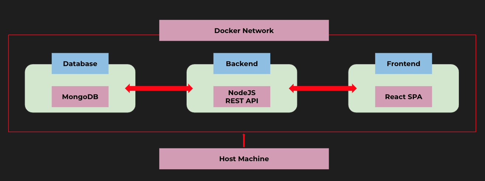
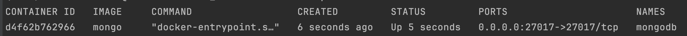
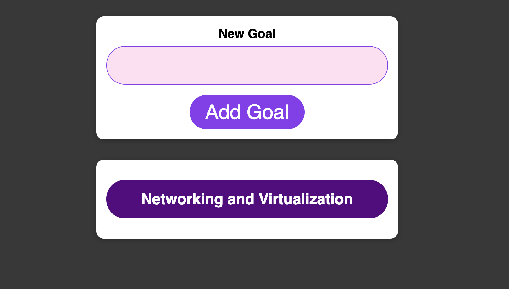

### Not a project! Just curious about the nodejs, react and mongo.

---

There are 3 components:
* frontend `>>>` React Single Page Application (SPA)
* backend  `>>>` Nodejs REST API service
* MongoDB  `>>>` Database for data.

All components are **dockerized** and set up a networking between them allowing to communicate with each other.

Pseudo-Schema:




### Networking: 

---

To create better communication between containers you should create a network:

``$ docker network create goals-app-network``

#### To run the project: 

----


1. Install mongoDB using docker container:

    ```$ docker run --name mongodb --rm -d --network goals-app-network mongo```
   
After this command you should see up and running **MongoDB container**: 




2. Inside the `backend` component there is a `Dockerfile`. You need to build the image using the following command:

   ``$ cd backend``
   
   ``$ docker build -t goals-backend .``

   ``$ docker run --name goals-app-backend --rm -d --network goals-app-network goals-backend``


3. Inside the `frontend` component there is also `Dockerfile`. You need to build the image using the following command:

   ``$ cd frontend``

   ``$ docker build -t goals-frontend .``

   ``$ docker run --name goals-app-frontend --rm -d --network goals-app-network goals-frontend``

Under the `localhost:3000` you will be able to obtain the UI: 




